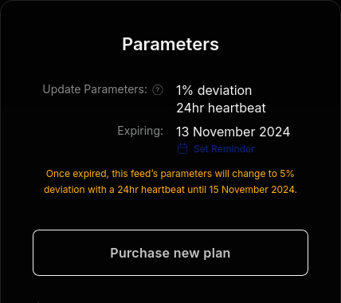
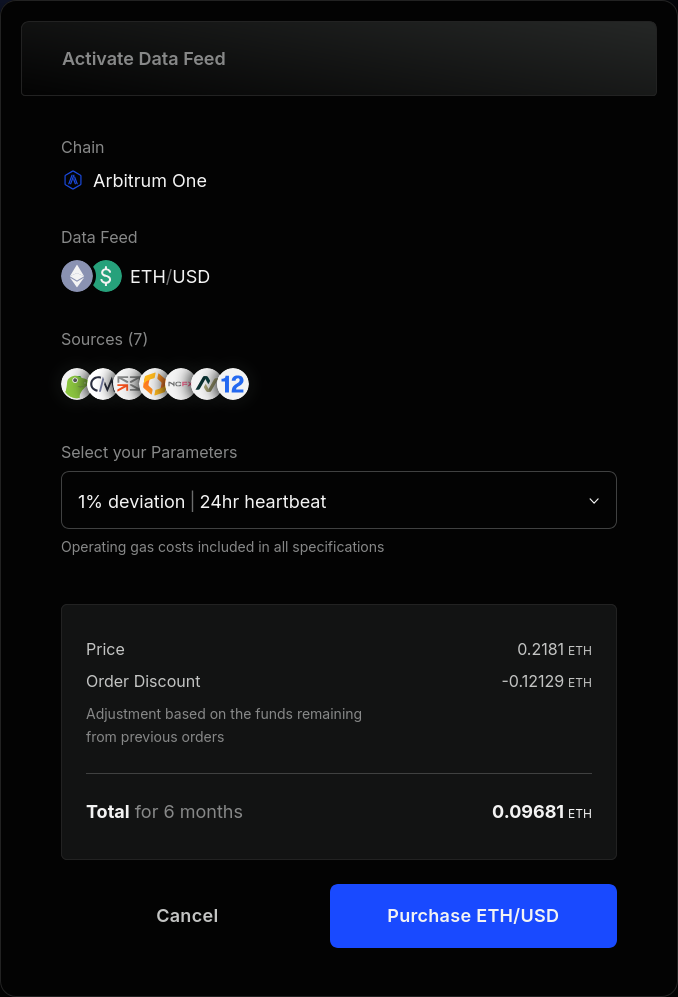

<PageHeader/>

# Using API3 Market

See the [Quickstart](../quickstart/index.md) page for a basic guide on how to use [API3 Market.](https://market.api3.org/)
This page will provide further details about using it in production.

## Update parameters

Update parameters specify the conditions that trigger a data feed update.
API3 Market supports two update parameters: [deviation threshold](#deviation-threshold) and [heartbeat interval](#heartbeat-interval).

### Deviation threshold

Deviation is the difference between the on-chain and off-chain values of a data feed.
It is measured as a percentage value, and an update is initiated when the deviation exceeds the **deviation threshold**.
For example, if the deviation threshold is 1% and the on-chain value of the data feed is 100, an update is initiated when the off-chain value goes below 99 or above 101.

::: info ℹ️ Info

Note that it is not possible to guarantee a maximum deviation amount, as there is no theoretical bound to how fast the off-chain value of a data feed can change.

When we refer to a 1% deviation threshold, we mean that at the time of a deviation threshold-related update, the deviation amount will be larger than 1%.

:::

API3 Market offers the following deviation threshold options:

- 5%
- 1%
- 0.5%
- 0.25%

::: info ⚠️ Warning

We assume that lower deviation thresholds are always more desirable, and thus do not validate if updates are necessary according to the update parameters.
In simpler terms, a data feed with 1% deviation threshold can be updated even if it has only deviated by 0.5%.
In the rare use-cases whose requirements do not agree with this, we do not recommend API3 data feeds to be used.

:::

Upholding a lower deviation threshold requires more frequent data feeds updates.
Consequently, you can expect higher [prices](#pricing) for lower deviation thresholds.

### Heartbeat interval

A heartbeat is a data feed update that was made to uphold a maximum period of time between two consecutive updates, which is called the **heartbeat interval**.

API3 Market only offers a 24 hour-heartbeat interval.

::: info ℹ️ Info

Similar to how deviation threshold works, it can be expected for an update to be initiated when the on-chain value is older than the heartbeat interval.
However, we have observed that some users `require()` in their contracts that the heartbeat interval is upheld.
To reduce the probability of this usage pattern causing any transactions to revert, we initiate heartbeat interval-related updates 2 minutes earlier than necessary.
Note that this still does not provide a hard guarantee, and your contract should be able to handle the case where the on-chain value is older than the heartbeat interval.

:::

## Plan durations

API3 Market offers 7 day-plans on testnets and 6 month-plans on mainnets.
Each purchased plan has an expiration date, and the respective update parameters will stop being upheld after that.
Let us go over a few example cases:

- BTC/USD on Ethereum is inactive.
  The user purchases 1% deviation threshold for 6 months.
  The data feed will immediately activate, and deactivate 6 months after.
- BTC/USD on Ethereum is active with 1% deviation threshold, to expire 3 months later.
  The user purchases 1% deviation threshold for 6 months (with a [discount](#discounts)).
  The expiration will be extended to 6 months from now.
- BTC/USD on Ethereum is active with 5% deviation threshold, to expire 3 months later.
  The user purchases 1% deviation threshold for 6 months (with a [discount](#discounts)).
  The data feed will switch to 1% deviation threshold, and deactivate 6 months after.
- BTC/USD on Ethereum is active with 0.5% deviation threshold, to expire 3 months later.
  The user purchases 1% deviation threshold for 6 months (with a [discount](#discounts)).
  The data feed will continue running with 0.5% deviation threshold for 3 months, switch to 1% deviation threshold, run for another 3 months, and deactivate.

In the case that plans with different deviation parameters are queued, API3 Market interface displays them as below.

::: info 💡 Tip

Once a plan has been purchased, API3 guarantees that the [update parameters](#update-parameters) will be upheld for the [plan duration](#plan-durations).
However, it is the user's responsibility to make sure that plans are purchased to keep the data feed active as long as necessary.
You can use the "Set Reminder" button under the expiration date to avoid forgetting to renew your plans.

:::

## Pricing

The gas cost of operating a data feed is a function of

- How expensive data feed updates are,
- How long the data feed will be operated,
- How often the data feed will be updated.

We maintain a history of data feed update gas costs and update counts required to uphold the offered deviation thresholds, and estimate the future operational costs of the offered plans based on these.

::: info 💰 Financial

The prices you see on API3 Market are the exact operational costs that we estimate (or $0.1/day, whichever is higher.)
This means that it is unlikely that you will find a better bargain.

We do not plan to monetize data feed plans at any point.
Our monetization model is designed around OEV, which makes this pricing strategy sustainable.

:::

### Discounts

It is not possible to estimate the future gas cost of operating a data feed with perfect accuracy.
In the case that we underestimate and find that the price was below the gas cost, we cover the difference.

::: info ⚠️ Warning

**On testnets only**, we stop updating if the payment runs out, even if the plan has not expired yet.
In such cases, simply purchase a new plan for updates to continue.

:::

In the case that we overestimate the price, the remainder rolls over to the next plan purchased for the same network–data feed pair, which appears as a **discount** on API3 Market.
Similarly, while a user is purchasing a plan for a data feed that is already active, the remainder of the payments made for the earlier purchases will appear as a discount.

::: info 💰 Financial

In some cases, the discount allows you to get the plan for free.

:::

### Gas grants

You can ask for a gas grant for your dApp by filling in [this form,](https://api3dao.typeform.com/to/TBTu8bJt) where you can request us to purchase plans for you.
