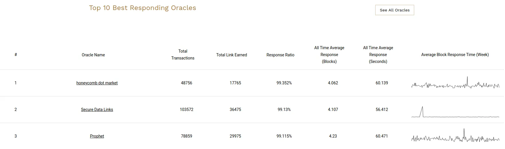

<PageHeader/>

# Security considerations

A data feed is an on-chain service that is driven by off-chain components.
Therefore, as long as you continue to use it, there will be ongoing security considerations that you should be aware of.

::: info ℹ️ Info

Api3 data feeds have never misreported or experienced an outage.
This page merely discusses theoretical scenarios that apply to any data feed.

:::

## Smart contract risk

Imperfections in a smart contract implementation may cause it to behave unexpectedly, potentially resulting in financial losses for interacting parties—a scenario known as smart contract risk.
Like all smart contracts, Api3ReaderProxyV1 carries this inherent risk.

We propose three methods to assess the smart contract risk.
You can refer to the related [audit reports.](https://github.com/api3dao/contracts?tab=readme-ov-file#security)
A more practical approach is to refer to [our historical TVS](https://defillama.com/oracles/API3) to understand the _battle-testedness_ of our data feeds.
Additionally, you are welcome to review the contracts behind [Api3ReaderProxyV1](/dapps/integration/contract-integration.md#api3readerproxyv1), specifically [Api3ServerV1](https://github.com/api3dao/contracts/blob/main/contracts/api3-server-v1/Api3ServerV1.sol) and [Api3ServerV1OevExtension](https://github.com/api3dao/contracts/blob/main/contracts/api3-server-v1/Api3ServerV1OevExtension.sol).
Our [contract developer docs](https://github.com/api3dao/contracts/tree/main/docs) provide additional context for understanding the design decisions behind these contracts.

## Privileged accounts

Api3ReaderProxyV1 is a [UUPS-upgradeable](https://eips.ethereum.org/EIPS/eip-1822) contract, which can be upgraded by [a 4-of-8 multisig](https://github.com/api3dao/contracts/blob/main/data/manager-multisig-metadata.json#L2) that is owned by members of the Api3 technical team.
This upgradeability feature is intended to be used only in exceptional occasions to respond to newly discovered compiler, library or contract vulnerabilities, or to migrate users to potential new versions of the contracts.

[A 4-of-4 multisig,](https://github.com/api3dao/contracts/blob/main/data/dapi-management-metadata.json#L2) which again is owned by members of the Api3 technical team, approves the root of a Merkle tree containing data feed configurations.
This means adding, removing or replacing API providers that contribute to the aggregation of data feeds requires signatures from all owners of this multisig.

::: info ℹ️ Info

Data feed source configuration depends on multiple factors including uptime, accuracy, incident response time, and qualitative considerations.
Multisig signers have access to this data and are responsible for its verification.

:::

## Data correctness

The [Api3 whitepaper](https://github.com/api3dao/api3-whitepaper) poses that all oracle data comes from API providers in practice, and the trust-minimized way to receive data from an API provider is for there to be no third-party intermediaries.
We have coined the term _first-party oracle_ to refer to this architecture, where API providers deliver oracle services without needing third parties to facilitate.

Api3 data feeds are on-chain aggregations of data feeds powered by individual first-party oracles.
Each API provider powers a single-source data feed on-chain, and the Api3 data feed is an on-chain median of these individual data feeds, which provides the strongest security guarantees (for example, compared to off-chain aggregation).
You can easily verify the first-party nature of our data feeds [directly on the data feed page in Api3 Market.](/dapps/integration/index.md#verifying-first-party-sources)

::: info ⚠️ Warning

While some oracle solutions are at peace with their third-party status, other oracle solutions such as Pyth incorrectly claim their oracles are first party.
This claim fails in two ways:
First, an API provider is a business that provides an API as a service, and most Pyth oracles are not API providers.
Second, even when a Pyth oracle is an API provider, their data is aggregated and served through Wormhole, introducing a third-party point of failure.

In general, when oracle services use an intermediary blockchain or state channel for delivery, they create a third-party system since the intermediary's consensus model will not match the aggregation model.
Consider a system where 7 API providers supply data and 100+ node operators provide aggregation and data availability—this creates two points of failure, typical of third-party oracle designs.
The secondary point of failure (the node operators) is typically weaker than the primary one (the API providers).
Consequently, when dApps use Pyth data on Ethereum, users pay Ethereum gas fees while only receiving security equivalent to [Wormhole.](https://www.google.com/search?q=wormhole+down+%22pyth%22)

:::

## Data availability

We obtain API provider-signed data for feed updates from publicly accessible APIs (the same ones you can use to [verify first-party sources on Api3 Market.](/dapps/integration/index.md#verifying-first-party-sources))
While similar to the [Coinbase price oracle](https://www.coinbase.com/blog/introducing-the-coinbase-price-oracle), our approach involves multiple API providers using our standardized protocol, enabling aggregation.
As a result, even if we cease updating a data feed, further updates remain possible.
MEV searchers, for instance, can access these APIs to perform financially relevant updates.
Similarly, our OEV implementation uses this mechanism, ensuring OEV updates continue even if we stop updating the feed according to the update parameters.

## Update parameters

Once a plan is purchased on Api3 Market, the respective data feed will maintain the advertised deviation threshold and heartbeat interval until plan expiration.
This depends on the Api3 technical team to keep the wallets that will send the update transactions funded, and maintain the infrastructure that will use these wallets to send the update transactions.
The operation is backed by dedicated monitoring personnel, automated alerts, and redundant infrastructure layers.

::: info ℹ️ Info

We have been providing oracle services as early as [2019](https://etherscan.io/txs?a=0x78e76126719715eddf107cd70f3a31dddf31f85a&p=1029), and were listed as the [best responding oracle](/assets/reputation-link.CxhU2iIj.png) among all Chainlink oracles by [`reputation.link`](https://www.google.com/search?q=%22reputation.link%22+chainlink) as of September 2020, which is when we published the [Api3 whitepaper](https://github.com/api3dao/api3-whitepaper) and requested to be removed from Chainlink data feeds.
An important driving factor for this was our insight into systemic issues that could harm users and our confidence in building a better solution.
With this understanding, we designed our architecture and operations from the ground up, leading to our current performance.

:::

## Oracle Extractable Value (OEV)

OEV updates provide identical guarantees to regular updates—they are on-chain aggregations of API provider-signed data—so they introduce no additional data integrity risk.
The OEV auction mechanism allows winners to frontrun updates of an artificially delayed base feed, a tradeoff designed to benefit the dApp.

Here's how the process works.
The lifecycle of a data point consists of three phases:

1. From 0-30 seconds: OEV searchers examine the data point and place bids on potential OEV opportunities.
2. From 30-60 seconds: If valid bids exist, the auction winner can update the data feed to capture OEV opportunities.
3. After 60 seconds: The data point becomes publicly available for updates, including our update parameter-based updates.

dApps using our system will experience a 30–60 second delay in their data feed.
While this delay concerns some users, we can evaluate its impact through a simple framework:
Consider a dApp that generates `X1` revenue with its current oracle solution.
Using Api3 data feeds would generate `X2` revenue (potentially lower than `X1` due to the delay) plus `Y` in OEV Rewards.
When `X1 < X2 + Y`—which is common—Api3 feeds are the more secure choice.

::: info 💡 Tip

An overlooked fact is that traditional oracle solutions without OEV capture are inherently vulnerable.
Their users have faced [hundreds of millions of dollars](https://members.delphidigital.io/reports/api3-the-state-of-oev) in exploits over the years—exploits that were entirely preventable.
Auditors should flag dApps lacking effective OEV capture mechanisms, and dApps continuing to use vulnerable traditional solutions should be required to justify this choice.

:::
