<PageHeader/>

# Quickstart

[API3 Market](https://market.api3.org/) serves a large and dynamic catalog of data feeds on all major EVM networks.
Follow this guide to learn how to use API3 Market to integrate a data feed to an example contract.

## Using API3 Market

- Go to [market.api3.org.](https://market.api3.org/)

- Click the toggle button to view the testnets, and pick one for which you have funds.

  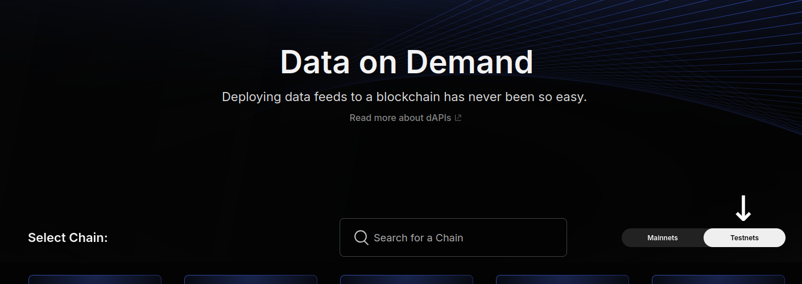

- On the network page, you will see a searchbar (1), some of the data feeds that are already active on the network under "Featured Feeds" (2), and a link to the catalog (3).

  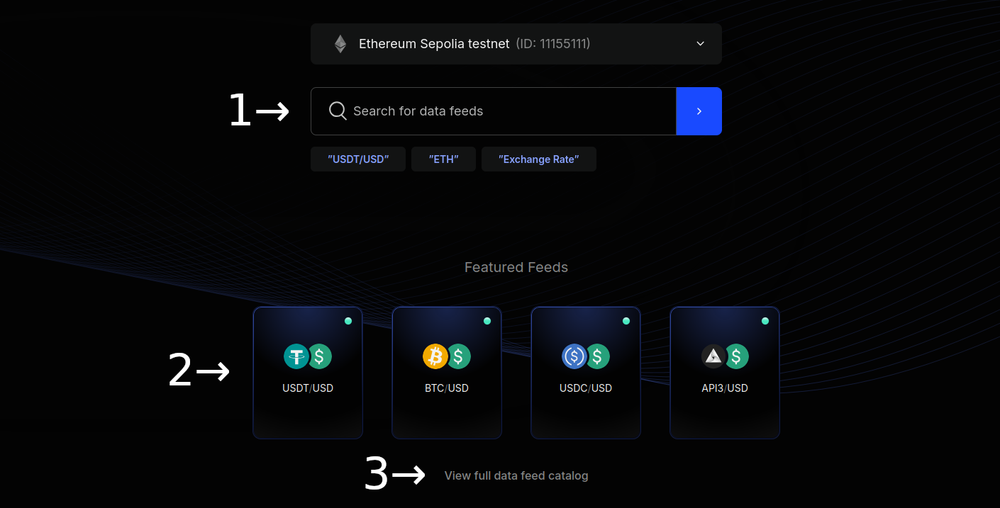

  Start typing the name of a data feed in the searchbar, and click it once it appears in the dropdown.

  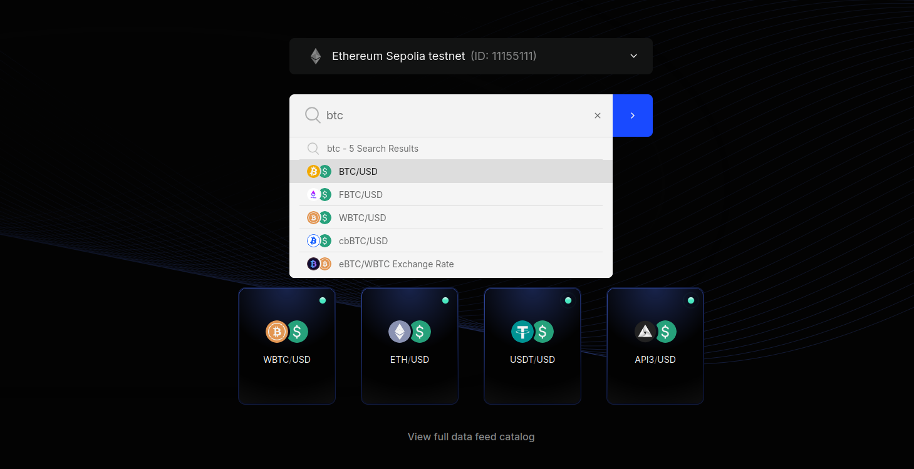

  Alternatively, you can view the catalog and click the data feed there, which will be equivalent to searching the full name of the data feed.

  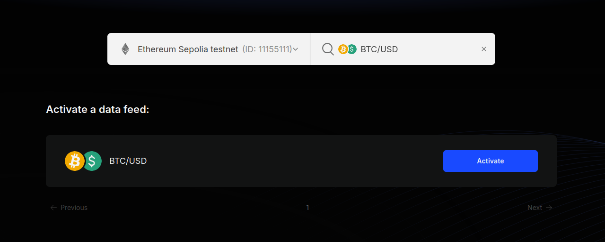

::: info 💡 Tip

All data feeds are inactive by default.
Purchasing a plan activates it until the plan expires.
Everyone can use an active data feed.
On the network page, active feeds appear as cards, and inactive feeds appear as rows with "Activate" buttons.

If you pick a data feed that is already active on the network, you will be taken to the data feed page directly.
Otherwise, you will be taken to the activation page first.
To experience the entire flow, we recommend you to pick a data feed that is not active.

:::

- If you have picked a data feed that is not active, you will be taken to the activation page next.
  Select the parameters, review the duration and the price, and click the "Purchase" button to pay.

  
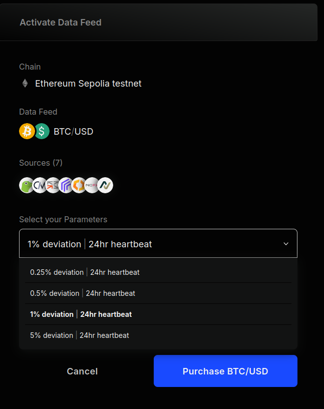

- Once your purchase transaction is confirmed, you can proceed to view the data feed page.
  Leave this tab open, we will come back to it later in the guide.

  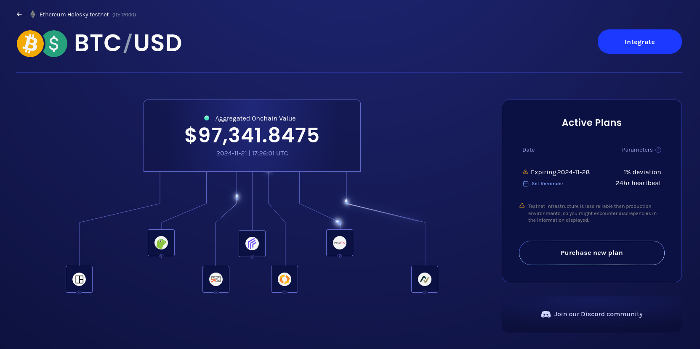

Congratulations! 🎉 You have successfully activated a data feed.
Let's use it in an example contract now.

## Remix example

::: info 💡 Tip

This section uses Remix IDE.
If you prefer using Hardhat, you can clone [`data-feed-reader-example`](https://github.com/api3dao/data-feed-reader-example) and follow the instructions in its README.

:::

- Go to [Remix.](https://remix.ethereum.org)

- While the "File explorer" tab is selected on the left sidebar, click the hamburger button and select "Clone".

  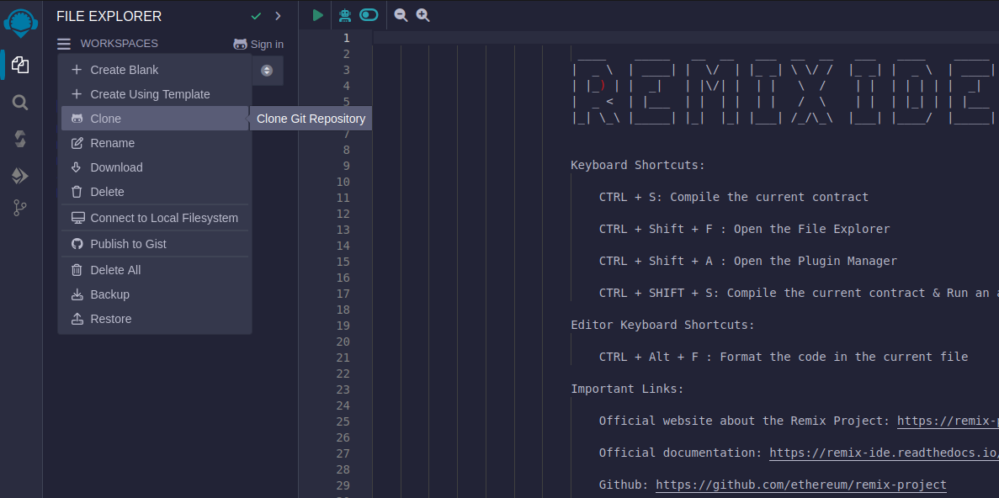

  Enter `https://github.com/api3dao/data-feed-reader-example` and click "OK".

- While the "File explorer" tab is selected on the left sidebar, double click `contracts/` to expand it, and click `DataFeedReaderExample.sol`.

  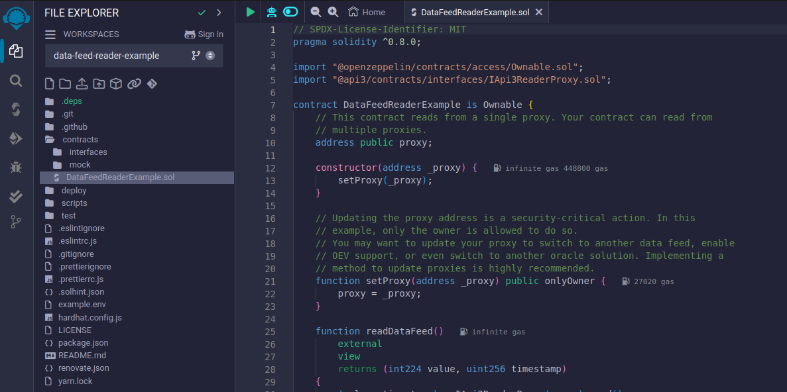

- While the "Solidity compiler" tab is selected on the left sidebar, click "Compile DataFeedReaderExample".

  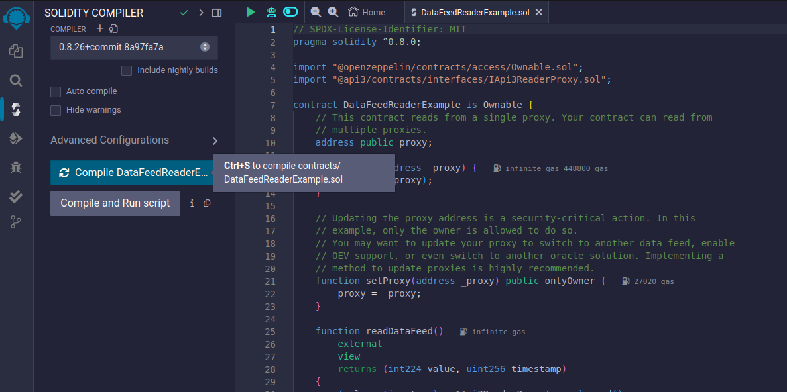

- While the "Deploy & run transactions" tab is selected on the left sidebar, select "Injected Provider - MetaMask" from the "Environment" dropdown.

  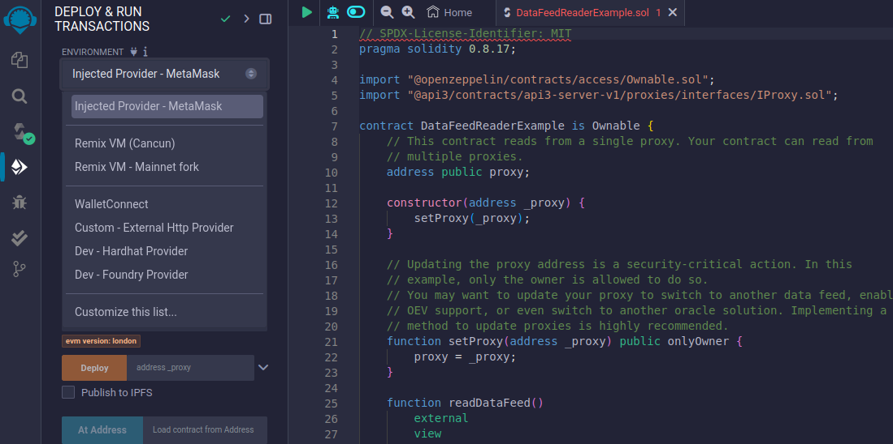

::: info 💡 Tip

If you have just used API3 Market to purchase a plan, your MetaMask wallet should be connected to the correct network.
If not, make sure that your wallet is connected to the network that the data feed is on, where we will deploy DataFeedReaderExample.

:::

- Return to the data feed page on API3 Market and click "Integrate".

  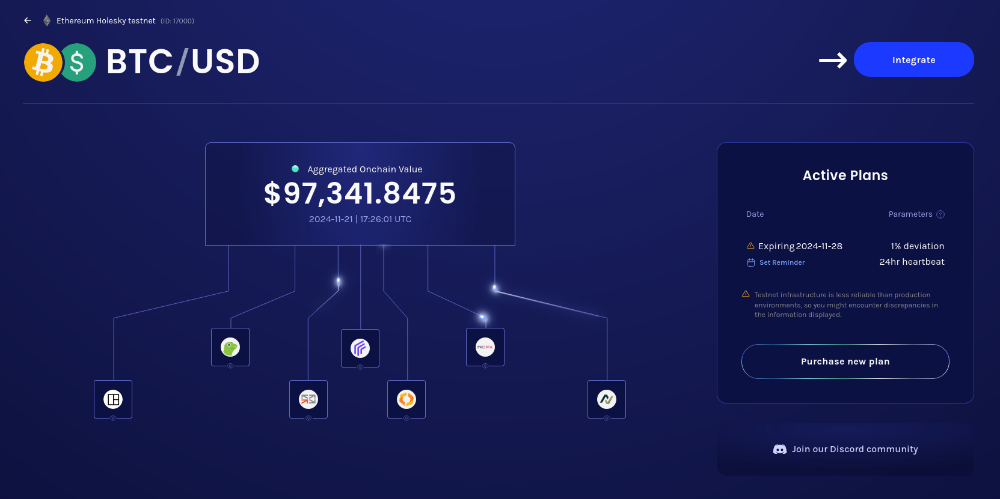

- Click the copy icon next to the displayed Api3ReaderProxy address.

  
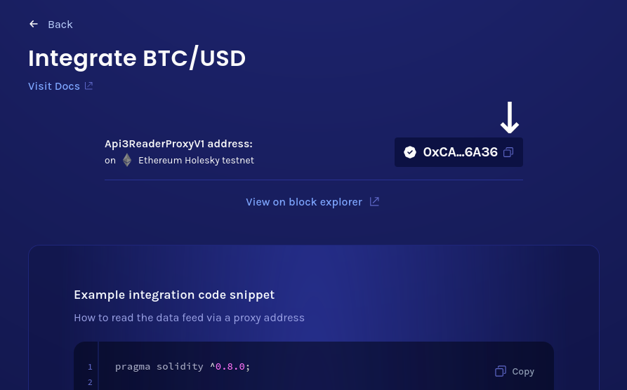

- Return to Remix IDE.
  While the "Deploy & run transactions" tab is selected on the left sidebar, paste the Api3ReaderProxy address in the textbox next to the "Deploy" button, and click it.

  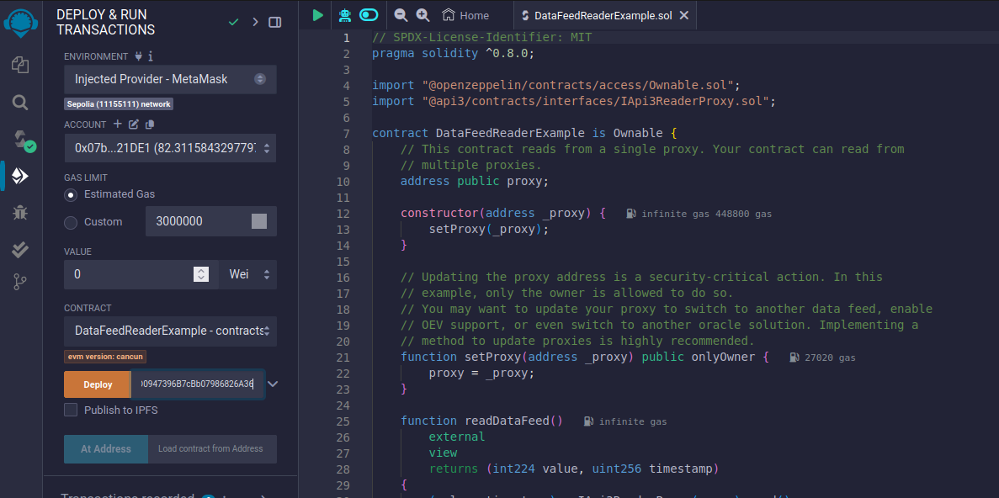

- After the transaction is confirmed, you can call the publicly accessible functions of DataFeedReaderExample.
  Expand "DATAFEEDREADEREXAMPLE AT ..." under "Deployed Contracts", and click "readDataFeed".
  You will see the values that DataFeedReaderExample read from Api3ReaderProxy.

  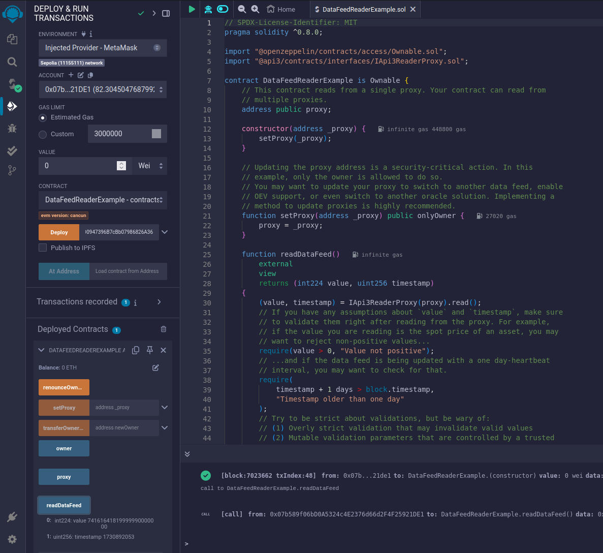

## What next?

This guide should be enough to get you started for a hackathon.
However, if you want to use API3 data feeds in production, continue reading the [integration section.](/dapps/integration)
Alternatively, find out how to [get paid](/dapps/oev-rewards) by using API3 data feeds.
