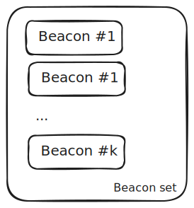

<PageHeader/>

# Data feeds

Searchers need a way to monitor real-time off-chain prices to find profitable
opportunities. Traditionally, searchers have needed to buy API subscriptions
from underlying oracle sources, creating additional friction in the process.
Api3 simplifies this process by providing the same data that is used for
updating data feeds to searchers publicly and without cost.

## How data feeds work?

Let's start from the ground up. The data feed logic is dictated by the Api3ServerV1
contract. The central part of Api3 feeds is first-party oracles, relying on
cryptographic signatures verified on-chain.

Internally, we refer to our data feeds as dAPIs. This is also the terminology used across Api3 contracts. We'll be following the same terminology in this section.

### dAPI structure

The simplest primitive is a "beacon".

<!-- NOTE: Source = https://excalidraw.com/#json=yxJpy6HX2MfkDhYU50FZA,-9KIXahH1QnCKmjCpkonPA -->


It consists of:

- Airnode address = The identifier of the data provider, e.g. Nodary.
- Template ID = A template represents an endpoint of the data provider API, e.g.
  ETH/USD.

Together they represent a data point from a specific data provider. Beacons are
identified by beacon ID, which is the hash of their Airnode address and template ID. They can be
aggregated into "beacon sets" which are identified by the IDs of the constituent
beacons.

<!-- NOTE: Source = https://excalidraw.com/#json=nMEuUgnoInKUysNfxOmYQ,syyRUbVMdsXvIwSLytYmlw -->


Both beacons and beacon sets can be used as price feeds. We use the term "data feed" to refer to
either of them. Term data feed ID is a common name for beacon ID or beacon set ID. Finally, a dAPI is simply a mapping from a human-readable data feed name
to a data feed ID.

<!-- NOTE: Source = https://excalidraw.com/#json=hjgWnU8kHd-8QnxwjMmPi,oaX0ncVhqlnF6hAtp6GLpA -->


### Updating data feed value

So far, we've referred to dAPIs and data feeds as sources of data, not
mentioning how they are kept up-to-date. Api3 feeds are permissionless and
anyone can perform an update, provided they have valid data. To update a beacon,
anyone can call `updateBeaconWithSignedData` on the Api3ServerV1 contract:

```solidity
function updateBeaconWithSignedData(
    address airnode, // Airnode address of the beacon to update
    bytes32 templateId, // Template ID of the beacon to update
    uint256 timestamp, // The off-chain timestamp of the data
    bytes calldata data, // The encoded price feed data (decoded as int256 internally)
    bytes calldata signature // The signature of the fields above signed by the airnode wallet (owned by the data provider).
) external returns (bytes32 beaconId); // The beacon ID that was updated
```

Similarly, to update a beacon set, one first updates the constituent beacons and
then calls `updateBeaconSetWithBeacons`:

```solidity
function updateBeaconSetWithBeacons(
    bytes32[] memory beaconIds // The beacon IDs of the constituent beacons
) external returns (bytes32 beaconSetId); // The beacon set ID that was updated
```

By updating a beacon set, we aggregate the values and timestamps of the
constituent beacons. The typical dAPI refers to a beacon set of multiple
sources. As dAPI references a particular data feed under the hood, modifying the underlying beacon set also updates the dAPI value.

<!-- NOTE: Source = https://excalidraw.com/#json=KlQJo32mDFkDGyydpyxbk,l6L2eSDpBlCCB9j2Ecu9pw -->


### Off-chain components

There are several off-chain components that are used to keep dAPI values up to
date:

1. [Airnode feed](https://github.com/api3dao/signed-api/tree/main/packages/airnode-feed) -
   Deployed by the data providers themselves, Airnode feed continuously queries
   the API of the data provider, processes the response, and signs it with the
   Airnode wallet. The cryptographically signed data is then pushed to Signed
   APIs.
2. [Signed API](https://github.com/api3dao/signed-api/tree/main/packages/signed-api) -
   Signed API accepts signed data from API providers and provides an API layer
   for off-chain querying.
3. [Airseeker](https://github.com/api3dao/airseeker) - Airseeker is an Api3 push
   oracle. It monitors the off-chain and on-chain data and triggers an update
   when needed.

All of these tools are open-sourced for transparency.

### Update schedule

dAPIs are updated based on the configured update parameters. An update is
performed whenever a dAPI value exceeds the allowed threshold or the feed was
not updated for a particular amount time.

## OEV updates

After a dAPI is updated, the changed value is reflected across all protocols
that use the particular dAPI. We call these "base feed updates" to differentiate
them from the OEV updates, which are dApp-specific. These are made by the
searchers who win auctions on the OEV Network.

For dApps, OEV is an extension to base feeds, supported by the Api3ReaderProxyV1
contract. This contract is a simple proxy that reads the value either from the
base feed or the OEV feed, whichever is fresher.

<!-- NOTE: Source = https://excalidraw.com/#json=YBOgsQx3LnXa_ct_qkAUr,W0k3A5A4Ln6BhECwl4OB6A -->


The OEV feed is specific to the dApp, and its update only reflects the price for
the dApp that uses this proxy. This is accomplished by the proxy being tied to an
immutable dApp ID field. This allows separate auctions to be held for each dApp.

To guarantee searchers' exclusivity privilege to capture OEV, the base feed
updates are delayed. Searchers bid for real-time data that can be used to update
the OEV feed. By winning an auction, a searcher is guaranteed that the data is
fresher than the base feed.

::: info ℹ️ Info

Base feed delay is accomplished by Signed APIs being configured to serve the signed data with 60s delay and provide a real-time version of this data, usable only for the auction winner. This design choice guarantees searchers the exclusive rights for data feeds update.

:::

### OEV feed

The OEV feed is derived from the base feed by changing its beacons to OEV
beacons.

An OEV beacon is derived from the base feed beacon by hashing its template ID
using `keccak256`. This makes it possible to share the signed data for OEV
beacons freely, because they cannot be used to update the base feed. The
Api3ServerV1OevExtension contract allows them to be used only by the auction
winner who has paid the adequate amount.

::: info ℹ️ Example

Say we have the following base feed beacon:

```jsonc
"0xfe395743aff41835420d109be4bf98b93e9d9670f5539fc6392578b4626ecedf": { // Beacon ID
  "airnode": "0xc52EeA00154B4fF1EbbF8Ba39FDe37F1AC3B9Fd4",
  "templateId": "0x1bb9efc88ac9d910a9edc28e8cad8959d196a551e15c9af3af21247f1605873f",
}
```

To derive the template ID of the OEV beacon, we hash its template ID:

```solidity
keccak256(abi.encodePacked(bytes32(0x1bb9efc88ac9d910a9edc28e8cad8959d196a551e15c9af3af21247f1605873f)))
// Output: 0xbc7896315bfd4b1186a05f219ec71a95def0d038617e7ae534075317866bfd1b
```

Which gives us the following OEV beacon:

```json
"0x154ca7c81eb1ed9ce151d5b6ad894c5ab79d19bee20d89eb061aaf24f788221f": { // Beacon ID
  "airnode": "0xc52EeA00154B4fF1EbbF8Ba39FDe37F1AC3B9Fd4",
  "templateId": "0xbc7896315bfd4b1186a05f219ec71a95def0d038617e7ae534075317866bfd1b",
}
```

Notice that the beacon ID is different, but the Airnode address is the same.

:::

### dApp IDs

Each dApp that uses OEV feeds is assigned a unique ID, called the "dApp ID". The
granularity of auctions is at the dApp level, meaning the auction winner is able
to update any of the price feeds associated with this dApp ID. This ID is
hardcoded in the OEV proxies of the dApp.

The ID has no meaning other than to group proxies of the same dApp together.

Searchers can derive the dApp ID from the information provided in the
[OEV dApps catalog](/oev-searchers/in-depth/#oev-dapps). Searchers can use [`unsafeComputeDappId`](https://github.com/api3dao/contracts/blob/52109d0d285d3ac485a2f0ed68bd7799e75a9722/src/proxy.ts#L57) from the `@api3/contracts` package.

::: info ℹ️ Example

Say we want to determine dApp ID for [dTRINITY](https://dtrinity.org/). From the OEV dapps catalog, we see the dApp alias is `dtrinity` and the chain is Fraxtal. Fraxtal has chain ID `252`. To derive the dApp ID we call `unsafeComputeDappId` with arguments `dtrinity` and `252`.

```js
const dTrinityDappId = unsafeComputeDappId('dtrinity', 252);
// 16210721173577624589952893185091679941657223823840386808143855919126917477566
```

:::

### dApp sources

Searchers need to know the proxy address and the underlying dAPI name used by
the OEV proxy. The dApps have full control over what proxies they use, and searchers
should refer to their documentation or inspect the chain-state of their contracts to get an
up-to-date proxy address.

To determine the underlying beacons used by the dAPI, you can use the
AirseekerRegistry contract on the target chain. Searchers need to monitor values for these beacons with the public Signed APIs. Note
that these are the base feed beacons and the searcher is expected to derive
the OEV beacons to monitor the OEV data.

#### Data feed details encoding

The AirseekerRegistry contract uses a particular encoding for data feed details
so that the details can be persisted on-chain as a single `bytes` value. The
callers need to decode this value to get the actual data feed details.

Decoding depends on whether the feed is a beacon or a beacon set. Assume we have
encoded `dataFeedDetails` and we need to decode it. Note that the encoding
follows a similar principle.

The decoding of a beacon:

```solidity
(address airnode, bytes32 templateId) = abi.decode(
  dataFeedDetails,
  (address, bytes32)
);
```

The decoding of a beacon set:

```solidity
(address[] memory airnodes, bytes32[] memory templateIds) = abi.decode(
  dataFeedDetails,
  (address[], bytes32[])
);
```

To know which encoding to use, you can check the length of the
`dataFeedDetails`. For a single beacon, the length is always `64` bytes, because
both `address` and `bytes32` are encoded using 32 bytes. For a beacon set, the
length depends on the number of beacons encoded.

::: info ℹ️ Example

Say there is a dApp proxy that uses the `ETH/USD` dAPI. We can compute the
details for this dAPI off-chain by:

```js
const encodedDapiName = ethers.utils.formatBytes32String('ETH/USD'); // 0x4554482f55534400000000000000000000000000000000000000000000000000
const encodedDapiNameHash = ethers.utils.keccak256(encodedDapiName); // 0x9e6138f8f57d7b493a8364edb0a0ac92399dfd890eecb9121050836a1749ba42
```

To determine the data feed ID for this dAPI, we can use the
`dapiNameHashToDataFeedId` function on the Api3ServerV1 contract:

```js
const api3ServerV1 = new ethers.Contract(
  api3ServerV1Address,
  api3ServerV1Abi,
  provider
);
const dataFeedId =
  await api3ServerV1.dapiNameHashToDataFeedId(encodedDapiNameHash); // e.g. 0x28d7af9ef50bde705ccabb77f27cfa481b998a4a01eaae22825835f611bf7ffe
```

To determine the data feed details, use the `dataFeedIdToDetails` function on
the AirseekerRegistry contract:

```js
const airseekerRegistry = new ethers.Contract(
  airseekerRegistryAddress,
  airseekerRegistryAbi,
  provider
);
const dataFeedDetails = await airseekerRegistry.dataFeedIdToDetails(dataFeedId);
```

The data feed details need to be decoded first. The following is a simplified
version of that decodes the data off-chain:

```js
const deriveBeaconId = (airnodeAddress, templateId) => {
  return ethers.utils.solidityKeccak256(
    ['address', 'bytes32'],
    [airnodeAddress, templateId]
  );
};

const decodeDataFeedDetails = (dataFeed) => {
  // The contract returns empty bytes if the data feed is not registered.
  if (dataFeed === '0x') return null;

  // This is a hex encoded string, the contract works with bytes directly
  // 2 characters for the '0x' preamble + 32 * 2 hexadecimals for 32 bytes + 32 * 2 hexadecimals for 32 bytes
  if (dataFeed.length === 2 + 32 * 2 + 32 * 2) {
    const [airnodeAddress, templateId] = ethers.utils.defaultAbiCoder.decode(
      ['address', 'bytes32'],
      dataFeed
    );

    const dataFeedId = deriveBeaconId(airnodeAddress, templateId);
    return [{ beaconId: dataFeedId, airnodeAddress, templateId }];
  }

  const [airnodeAddresses, templateIds] = ethers.utils.defaultAbiCoder.decode(
    ['address[]', 'bytes32[]'],
    dataFeed
  );

  const beacons = airnodeAddresses.map((airnodeAddress, idx) => {
    const templateId = templateIds[idx];
    const beaconId = deriveBeaconId(airnodeAddress, templateId);

    return { beaconId, airnodeAddress, templateId };
  });

  return beacons;
};
```

Say the following is the output after decoding the data feed details:

```json
[
  {
    "beaconId": "0x853a5cc0a517489779025cc8a48e771461a0616665efd6a61424e57997e6dbed",
    "airnodeAddress": "0xC9B494D3c6eA3fD42779Df9A136Db10374c98D80",
    "templateId": "0x3bdd99217e0be6a0c7812aad3138bd941c2eaf60410740cac7d716d1c5e05558"
  },
  {
    "beaconId": "0xefec8dab2bc20fcc03141d6e521148564e548046d291e116d02581aea7407533",
    "airnodeAddress": "0x6b56E47DccFbC82D63Df3da417d26e8B1B877f0f",
    "templateId": "0xdeda2f7938bf877d2f011aa550852d3459794e16944ea0b7513465479752ba93"
  },
  {
    "beaconId": "0x00be0673ee8afc9a25fc12edddb7fbe293a7da8f04953171243b594c257141d7",
    "airnodeAddress": "0xa924847354c551C79BAE7E75529364bA0449e51A",
    "templateId": "0x9f66583540b490e11ee1b40c7b561946eceb96273489c95328c0cd290060129b"
  },
  {
    "beaconId": "0x83a32cce0fc108005ffb0f745f58f1f730770a361a3f051fd058357d525a2182",
    "airnodeAddress": "0x5791Fb78D4e37A9D0f0003199D1AE1A8C04C8d89",
    "templateId": "0x0970b1e622f50950bf55b3375a849cdd8f8ecbb0ff47d4bde3cbfb225dfcc607"
  },
  {
    "beaconId": "0x752bb8fa00e8c35657a8414884ad4ab976a56fa7d015eb7ade1d60eb15e2a895",
    "airnodeAddress": "0xbC6471E88d8aFe936A45bEB8bd20a210EBEF6822",
    "templateId": "0xb501fe47e4ad40fd34f5e5a685e79b991b51e2c887d2dbe35bc645ed1f390241"
  },
  {
    "beaconId": "0x4385954e058fbe6b6a744f32a4f89d67aad099f8fb8b23e7ea8dd366ae88151d",
    "airnodeAddress": "0xc52EeA00154B4fF1EbbF8Ba39FDe37F1AC3B9Fd4",
    "templateId": "0x154c34adf151cf4d91b7abe7eb6dcd193104ef2a29738ddc88020a58d6cf6183"
  },
  {
    "beaconId": "0xf580f27c696b05c8572266e6db5cb5b12a562cac5dfb2e7c240a5ef7d845aebf",
    "airnodeAddress": "0x31C7db0e12e002E071ca0FF243ec4788a8AD189F",
    "templateId": "0x046e65143918e48adc0a77bada55931622531819be4a7473d80b7f906b813105"
  }
]
```

:::

## Public Signed APIs

Signed APIs store the data pushed by Airnode feeds and expose them to the public
via an API. As mentioned, base feed updates are delayed, permissionless and can be
updated by anyone. The OEV feeds are real-time and can only be updated by the OEV auction winner.
Api3 runs Signed APIs and makes them publicly available. They are deployed on
AWS, ensuring maximum uptime and reliability.

Signed APIs only support querying data for a particular Airnode feed at a time. The
Airnode address is supplied as an HTTP path parameter. The endpoint is cached
and can be called repeatedly. However, excessive call frequency is restricted by
rate limiting or full access denial.

### Base feed endpoints

The following are the base feed endpoints that are publicly available:

1. `https://signed-api.api3.org/public/<AIRNODE_ADDRESS>` - The official Api3
   Signed APIs used by the push oracle to update the base feeds.

For example, see the
[Api3 response for Nodary Airnode feed](https://signed-api.api3.org/public/0xc52EeA00154B4fF1EbbF8Ba39FDe37F1AC3B9Fd4).

### OEV endpoints

The following are the OEV endpoints that are publicly available:

1. `https://signed-api.api3.org/public-oev/<AIRNODE_ADDRESS>`

For example, see the
[Api3 response for Nodary Airnode feed](https://signed-api.api3.org/public-oev/0xc52EeA00154B4fF1EbbF8Ba39FDe37F1AC3B9Fd4).

### Response

The response of the Signed API is a JSON object with the following fields:

1. `count` - The number of signed data entries.
2. `data` - An object with the signed data entries. The keys are the beacon IDs
   and the values are the signed data objects for the particular beacon(s).

For example:

```json
{
  "count": 2,
  "data": {
    "0xcdaf3ecba9e3f1457b64b1dd33dd6dbd5d3a0d43dbcb6b94fbf755ca8a64f1c2": {
      "airnode": "0x31C7db0e12e002E071ca0FF243ec4788a8AD189F",
      "encodedValue": "0x0000000000000000000000000000000000000000000000000f710eec75e16680",
      "signature": "0x5d382d6636f6b87642db580586bac7f57609f47d30e133dbb6bedede233a6d58065cb4aefbe2d2db1bd61ee9734a8671c05a5f2f79a0192ef491662ba3e390ac1c",
      "templateId": "0x174bd80b61ec8451784391df43c8c4ffc4ae82216a65cc15107bfdf4c29f6ca1",
      "timestamp": "1727085105"
    },
    "0x4048c53a7e6d4b857fb04bd4f496691e526f1de8f38880469ec834bc46021cd4": {
      "airnode": "0x31C7db0e12e002E071ca0FF243ec4788a8AD189F",
      "encodedValue": "0x0000000000000000000000000000000000000000000000000210a4cfc6940000",
      "signature": "0x00b84c978f9bab8639a8931990aede93ce34b8f9564ced755499bac503a39d7e7dad882dd1be77954bbbf152b436912204a29a1260283dda863cf489f631a17b1c",
      "templateId": "0xee8d0cab5281c59547d4ae9021121df9aec759d457c51b905296610fbef58bed",
      "timestamp": "1727085103"
    }
  }
}
```
