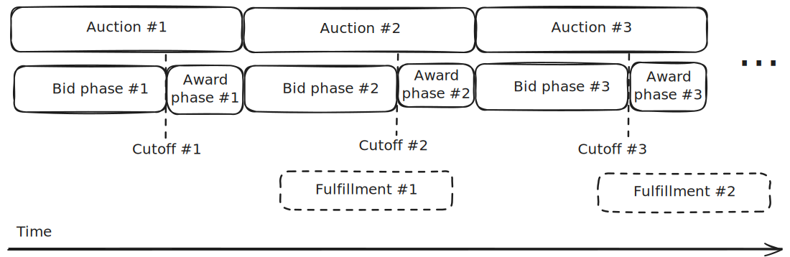

<PageHeader/>

# Overview

Oracle Extractable Value (OEV) is a subset of Maximal Extractable Value (MEV) that occurs as a result of an oracle update.

The idea is that different oracle updates have different importance.
Some updates expose profitable opportunities on the market. Searchers actively compete
with each other to be the first to realize these - paying a majority of the exposed value
to block validators in the process. This dynamic is unhealthy, because the
majority of the value should be split between the dApp and the searcher that
realizes the opportunity.

OEV solves this problem by auctioning off the exclusive rights to execute the
oracle update(s), allowing searchers to atomically update the price feed(s) used
by the dApps and capture opportunities in the market. The exclusive update
rights guarantee no competition and searchers avoid paying premiums on gas fees.

With OEV, searchers announce their intent to perform oracle updates along with
the amount they are willing to pay for it. The process is facilitated by open auctions,
bound by rules enforced on-chain. The auction winner must pay the announced
amount, which in return allows them to perform the oracle update and capture
profitable opportunities.

## Practical example

Imagine an overcollateralized lending platform that uses Api3 price feeds.
Borrowers in the protocol can be liquidated with an incentive whenever their
position becomes unhealthy to ensure the protocol remains solvent. Say
liquidations can occur if the loan-to-value ratio exceeds 90%. Let's look at
what happens with the protocol's health over time.

Assume that initially there are no unhealthy positions. Many of the price feed
updates that happen are "unnecessary" because they don't expose any unhealthy
positions and the protocol remains healthy. However, after some time there is a
price drop that causes many positions using that asset as collateral to approach
the 90% liquidation threshold.

In this scenario, the next price update that causes a position to become
unhealthy is valuable. From the protocol's perspective, this affects its
solvency and presents a threat. For a searcher, this presents a
profitable opportunity. In theory, the value of the price update equals to the
profit the searcher can make.

Searcher monitors the dApp and public Api3 data sources and sees that a position will become unhealthy
using the oracle data. They announce that they want to purchase exclusive
priority for updating the price feeds and pay X in return. They win the auction,
pay X to the dApp, and execute the price feed updates and liquidation
atomically.

The concept of OEV is not limited to liquidations but can occur anywhere where
price feed updates potentially expose profitable opportunities, such as
arbitrage and many others.

## OEV distribution

To update the data feed, the auction winner must pay the bid amount they
announced during the auction. These payments constitute auction proceeds. Majority of these proceeds go back to the dApp in the form of [OEV Rewards](/dapps/oev-rewards/). Searchers, in return, get exclusive rights to capture
the OEV and get to capitalize on the remaining revenue of the opportunity.

Thus, the majority of the OEV is distributed to the dApp and the
searchers.

## How do auctions work?

Api3 uses a combination of the [OEV Network](#oev-network) and the
[OEV Auctioneer](#oev-auctioneer) to power the OEV auctions in a secure and
transparent way.

At a high level, auctions repeat continuously and indefinitely. There is a
separate auction for each dApp and each auction takes a fixed amount of time. Each time an auction ends, a new one begins and the same process
repeats.

<!-- NOTE: Source = https://excalidraw.com/#json=VHSz5AhV0HA88hUvabVJv,AhhEkjO7HE_4MOqbkrBGsw -->

### Bid phase

Auctions run in two phases - the bid phase and the award phase. During the
bid phase, searchers look for OEV opportunities for the particular dApp
by monitoring the off-chain data. When an opportunity is detected, they
place their bid based on its value.

It is important to understand that bids must be placed before the end of the bid phase, which establishes a cutoff period. The auction winner is able to use only price feed data with timestamp up to this cutoff period.

### Award phase

The award phase starts immediately after the end of the bid phase. All bids placed during the bid phase are evaluated and the eligible bid with highest amount is selected as winner and provided a cryptographic signature allowing them to make the price feed updates up to the cutoff period. This signature is usable only by the auction winner. A requirement for updating the price feed is paying the announced bid amount in the same transaction.

### Fulfillment

Auction winner is required to make use of the auction data and pay for the winning bid to fulfill the purpose of the auction. After paying for the auction, they are required to report the fulfillment to the auction platform with the transaction hash of the update.

The fulfillment is verified and provided the update was correct, the auction winner's collateral is released. If the fulfillment is not reported or incorrect information is submitted, the collateral is slashed. Fulfillment has a large reporting period and the auction winner is in full control of when they choose to report.

### OEV Network

The OEV Network hosts auctions transparently, ensuring that any disputes can be
resolved by analyzing the on-chain data. Searchers submit their bids on-chain,
where the winner is announced and given exclusive rights to execute the oracle
update.

### OEV Auctioneer

A key component of OEV is an off-chain auction system that processes the
auctions taking place on the OEV network. We call this system OEV Auctioneer,
and it is managed by the Api3 DAO. The integrity of OEV Auctioneer is ensured by
using the OEV Network for all important actions, such as announcing the auction
winner.

## Get started with OEV

Here are resources to help you get started with OEV:

1. Dive deeper into OEV by reading the
   [OEV Litepaper](https://raw.githubusercontent.com/api3dao/oev-litepaper/main/oev-litepaper.pdf).
2. Check out the [Getting started](/oev-searchers/in-depth/) section to see how
   to start searching.
3. Connect with other developers and OEV enthusiasts in our
   [OEV Discord channel](https://discord.com/channels/758003776174030948/1062909222347603989).
4. Follow Api3 on [X](https://x.com/api3dao) for the latest news and updates on
   OEV.
